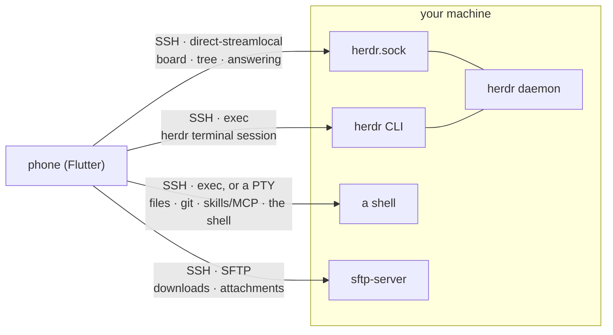

# Herdr Pocket

**English** ｜ [简体中文](README.zh-CN.md)

<p align="center">
  
</p>

A beautiful Flutter client for [herdr](https://herdr.dev): a status board for the
coding agents running on your own machines, a live terminal one tap behind each,
and a plain SSH terminal for any machine you have saved.

Cross-platform: mobile and desktop, from one Flutter codebase.

<p align="center">
  
  
</p>

---

## What it does

**The board.** Every agent on every machine, grouped by what it needs — `needs
you` first. Answer the ones that are waiting on you from their own screen.

**The tree.** Workspaces, tabs and panes, the way herdr sees them.

**The terminal.** A real character grid for any pane: scrollback, selection and
copy, bracketed paste, a key bar, and the whole tab's split layout mirrored.

**A shell of its own.** The same terminal on any machine you have saved, herdr or
not — `tmux` if it is installed, a login shell if it is not.

**The composer.** Type a whole message and send it in one write, with `/` for
skills and MCP and `@` for files.

**Files.** Browse a pane's working directory, read a file in it, download it to
the phone.

**Git changes.** The pane's directory as a repository: staged, unstaged,
untracked, conflicted, ahead/behind, and a diff for any file.

**Starting an agent.** Pick a directory and an agent — in a fresh `git worktree`
if you want one. Or drop an agent into an idle shell pane.

**Attaching a file.** Paste text, pick a photo, or take one; it is uploaded and
its path typed into the terminal.

**Machines.** SSH hosts, credentials in the platform keystore, pairing by QR code.

**Notifications.** A local alert when an agent starts waiting on you.

**Updating itself.** Settings → *Check for updates*: it downloads the new APK and
hands it to the system installer.

---

## Running it

```sh
flutter pub get
flutter run -d macos          # development: talks to a local daemon directly
flutter run -d <device-id>    # any connected device
```

### Connecting to a machine

The app does not discover machines; you add them.

**Pair by QR code** (recommended) — run `hdp pair` on the machine and scan it. See
[Pairing a phone](#pairing-a-phone-hdp).

**Or add it by hand:**

1. Open the board and tap the machines icon (top left).
2. **Add machine**: label, host, port, username.
3. Choose **Private key** and paste an OpenSSH private key, or **Password**.
4. Save. The app selects the new machine and connects.

On first connection you are shown the machine's host key fingerprint, to check
against the machine before trusting it.

### What the machine needs

- **herdr 0.9.0 or newer**, running.
- An SSH server with **stream-local forwarding** on — the OpenSSH default; if it is
  off, add `AllowStreamLocalForwarding yes`.
- The **SFTP subsystem**, only to move whole files: downloading one to the phone,
  or attaching one to an agent.

Nothing else — no bridge binary, no helper script, no port to open.

---

## Architecture



One SSH connection, four ways in, and nothing installed on the machine for the
app's sake. The daemon's Unix socket is reached with SSH's
`direct-streamlocal@openssh.com` channel — no helper, which is what makes this
work against **stock herdr**. herdr has no filesystem, git or skills API, so those
go through the machine's shell; whole files move over SFTP.

---

## Testing

```sh
flutter analyze && flutter test   # ~1000 tests, ~45s
sh tool/ci_tests.sh               # the same suite, and it fails if anything skipped
patrol test -d <device>           # on-device smoke tests; by hand, needs patrol_cli
```

`flutter test` skips the tests that need a live daemon and a live SSH server;
`tool/ci_tests.sh` starts both and fails if anything skipped — that is what CI runs.
`patrol_test/` cannot be run with `flutter test`; those tests need Android's own
instrumentation runner.

---

## Pairing a phone: `hdp`

```sh
curl -sSL https://raw.githubusercontent.com/weekitmo/herdr-pocket/main/cli/hdp/install.sh | sh
hdp pair
```

It prints a QR code. Scan it from the app and the phone's key is installed on that
machine and the address saved.
