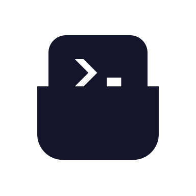
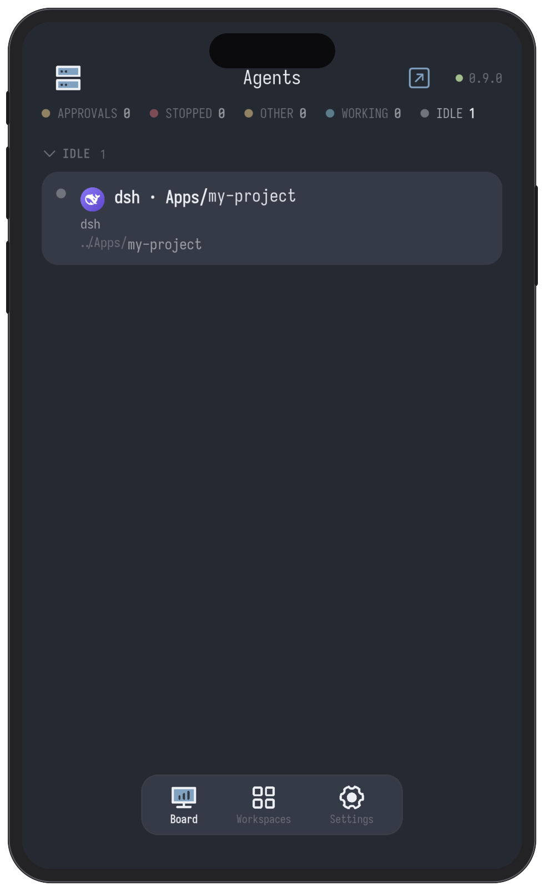
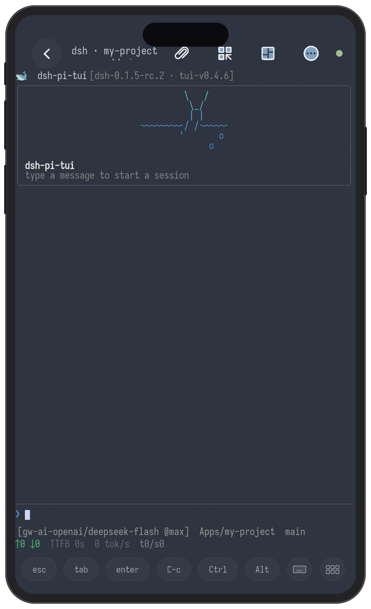
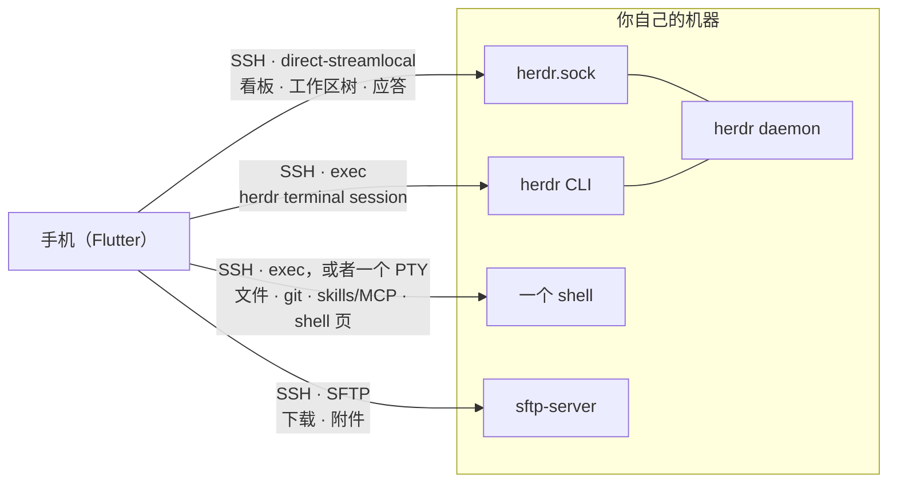

# Herdr Pocket

[English](README.md) ｜ **简体中文**

<p align="center">
  
</p>

一个好看的 [herdr](https://herdr.dev) Flutter 客户端：一块看板，看你自己机器上跑着的
编码 agent，每个 agent 后面一步就是活的终端；任何一台存过的机器，还能直接开一个
普通 SSH 终端。

跨平台 —— 一份 Flutter 代码，手机和桌面都能跑。

<p align="center">
  
  
</p>

---

## 功能

**看板。** 每台机器上的每个 agent，按「它需要什么」分组 —— `需要你` 在最前。等你的
那些，在它自己的屏幕上直接回答。

**工作区树。** 工作区、标签页、窗格，就是 herdr 里的那个样子。

**终端。** 任意窗格都是真实的字符网格：回滚、选中复制、bracketed paste、按键条，
整个 tab 的分屏布局也能镜像过来。

**自己的 shell。** 同一个终端，开在任何一台你存过的机器上，有没有 herdr 都行 ——
装了 `tmux` 就跑 `tmux`，没装就是登录 shell。

**聊天窗。** 在手机上敲一整条消息，一次写出去；`/` 是这台机器的 skills 和 MCP，
`@` 是文件。

**文件。** 浏览窗格的工作目录、读文件、下载到手机。

**Git 改动。** 把窗格目录当仓库读：已暂存 / 未暂存 / 未跟踪 / 冲突、与上游的
ahead / behind、任意文件的 diff。

**起一个 agent。** 选目录 + 选 agent，想要独立环境就开一个新 `git worktree`；
也可以把一个 agent 丢进空闲的 shell 窗格。

**附件。** 粘文字、选图、拍照：传到机器上，路径自动打进终端。

**机器。** SSH 主机、凭据存在 keystore 里、配对扫二维码。

**通知。** agent 开始等你的时候，来一条本地提醒。

**自己更新自己。** 设置 → *检查更新*：下载新的 APK，交给系统安装器。

---

## 跑起来

```sh
flutter pub get
flutter run -d macos          # 开发用：直接连本机 daemon
flutter run -d <device-id>    # 任何连着的设备
```

### 连一台机器

应用不会自动发现机器，机器是你自己加的。

**扫码配对**（推荐）—— 在机器上跑 `hdp pair`，扫它打出来的码。
详见[用手机配对](#用手机配对hdp)。

**或者手动加：**

1. 打开看板，点左上角的机器图标。
2. **添加机器**：名称、主机、端口、用户名。
3. 选 **私钥** 并粘贴一份 OpenSSH 私钥，或者选 **密码**。
4. 保存。应用会选中这台机器并连接。

首次连接会给你看这台机器的主机密钥指纹，信它之前去机器上对一遍。

### 机器上需要什么

- **herdr 0.9.0 或更新版本**，正在运行。
- 一个开着 **stream-local forwarding** 的 SSH 服务端 —— OpenSSH 默认就开着；
  关掉了就加 `AllowStreamLocalForwarding yes`。
- **SFTP 子系统**，只在搬运整份文件时才需要：下载一个到手机，或者给 agent 附一个。

别的都不需要 —— 没有桥接二进制，没有辅助脚本，也没有要开的端口。

---

## 架构



一条 SSH 连接，四条路，机器上不为这个应用装任何东西。daemon 的 Unix socket 用 SSH 的
`direct-streamlocal@openssh.com` channel 直连 —— 不需要辅助程序，所以对着**原版 herdr**
就能用。herdr 没有文件系统、git、skills 的 API，这些走机器的 shell；整份文件走 SFTP。

---

## 测试

```sh
flutter analyze && flutter test   # 约 1000 个测试，约 45 秒
sh tool/ci_tests.sh               # 同一套，只要有测试被跳过就失败
patrol test -d <device>           # 上机冒烟，手动跑，需要 patrol_cli
```

`flutter test` 会跳过那些需要真 daemon、真 SSH 服务端的测试；`tool/ci_tests.sh` 会把两者
都起起来，并且**只要有东西被跳过就失败** —— CI 跑的就是这条。`patrol_test/` 不能用
`flutter test` 跑，那些测试要 Android 自己的 instrumentation runner。

---

## 用手机配对：`hdp`

```sh
curl -sSL https://raw.githubusercontent.com/weekitmo/herdr-pocket/main/cli/hdp/install.sh | sh
hdp pair
```

它会打出一个二维码。用应用扫一下，这台手机的密钥就装到了那台机器上，地址也一并存好。
