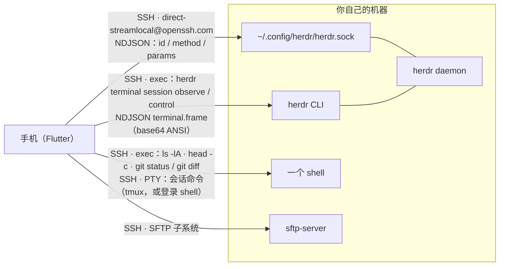

# herdr-pocket 技术细节

> 给改这个仓库的人，以及替人改这个仓库的 agent。README 只讲用户看得见的东西；
> 这里讲它是怎么做到的、为什么这么做、以及哪些坑已经踩过。
> 动手前的红线（不许 Material、feature first、不要裸跑 `dart format` 之类）在
> [`../AGENTS.md`](../AGENTS.md)。

## 1. 四条通路

机器上**什么都不用装**（除了 herdr 本身），没有桥接二进制、没有辅助脚本、没有要开的端口。
四条通路全都跑在同一条 SSH 连接上，区别只是打开之后说什么方言：

### 1.1 socket —— 看板、工作区树、起 agent、应答

`SSHClient.forwardLocalUnix(path)`（`dartssh2` 4.1.0），走
`direct-streamlocal@openssh.com` channel，直连 `~/.config/herdr/herdr.sock`。

- 方言是**官方 NDJSON**：请求 `{"id","method","params"}`，响应对应一行。
- **`params` 必须存在**，哪怕它是 `{}`。
- **错误信封里的 `id` 是空串**，不回显你发的 id ⇒ 响应只能靠**连接**关联，不能靠 id。
- **socket 是单次的**：一个请求、一行响应，然后关闭 ⇒ **每请求一个 SSH channel**。
  这是「看起来慢」的来源，也是不能自己维护长连接的原因。
- 事件用 `events.subscribe` 长连接。**订阅要先于读取**（`lib/data/board_sync.dart` 开头
  就是这个论证）：反过来会留一个缺口 —— 读完到订阅之间发生的变化永远看不到，而且
  因为没有看到所以也没有重试，看板会一直错到下一次无关的变化顺手纠正它。

### 1.2 终端镜像 —— 服务端渲染的帧

SSH exec：`herdr terminal session observe <pane> --cols N --rows M`（只读）或
`... control ...`（可输入）。输出是 NDJSON `terminal.frame`：
`{type,seq,encoding,full,width,height,bytes}`，`bytes` 是 base64 的 ANSI ——
**daemon 已经按我们给的尺寸渲染好了**，客户端不做终端仿真以外的事。
control 模式从 stdin 读 `terminal.input` / `resize` / `scroll` / `release`。

**观察不是 resize。** 用一个 40×12 的小窗口 observe，用户真实窗格仍然保持自己的
尺寸和矩形 —— 这就是「手机是 viewer，永远不动你的屏幕」这条产品承诺的实现。

### 1.3 shell —— 文件、git、skills/MCP、shell 页

同一连接上 exec 一条 shell 命令。退出码**随输出返回**：命令尾部 `printf` 一个
`\n§EXIT§<code>` 哨兵，`splitTrailingSentinel()` 负责切开（`lib/data/remote_fs.dart`）。
哨兵里带一个真换行，所以它永远不可能出现在输出的第 0 个字节。

- 列目录 `ls -lA`、读文件 `head -c`（预览截断，二进制会直说）。
- git：`git status --porcelain=v2 --branch -z`、`git diff`。herdr 自己没有任何 git API，
  只有 `worktree.list`（一个分支名和拓扑，没有改动文件）。
- skills 与 MCP：`lib/data/remote_capabilities.dart` 用**一条**命令一起拿（31 个 skill
  根目录 + 14 处 MCP 配置），回复按三个 marker 切分：`HERDR_HOME\t<path>`、
  `<path>\t<description>`、`\u0001HERDR-FILE\u0001<path>`。控制字符是故意的 ——
  一个配置文件能伪造的 marker，就是会把文件切成两半的 marker。
- **shell 页**（`lib/data/transport/shell_transport.dart` + `lib/ui/pages/shell/`）：
  `SSHClient.execute(cmd, pty: …)` 直接跑命令（命令留空则 `client.shell(pty: …)` 开登录
  shell），不是把命令打进一个登录 shell（否则会回显、依赖远端 shell 方言、
  命令结束后 shell 还活着而没有退出码可报）。

⚠️ **`ssh host <cmd>` 是非登录 shell，PATH 比你以为的窄**（macOS 的
`/opt/homebrew/bin`、Linux 的 `~/.local/bin` 通常不在）。两处都吃过这个亏：

- 远端 herdr 路径解析必须 `command -v herdr || $HOME/.local/bin/herdr` + 可执行性校验
  （`lib/data/transport/herdr_transport.dart`）。
- 默认会话命令自带前缀：
  `PATH="$HOME/.local/bin:/opt/homebrew/bin:/usr/local/bin:$PATH"; tmux new -A -s herdr-pocket || exec "$SHELL"`
  —— 前缀解决 PATH，`||` 让没装 tmux 的机器**退化成登录 shell**，而不是停在一个退出码上。

### 1.4 SFTP —— 整份文件

下载和附件走 SFTP 子系统，因为 shell 命令不是传字节的工具。**上传路径**是两边分着搭的：
目录用 shell 的 `mkdir -p`（SFTP 的 mkdir 不建父目录），字节交给 SFTP。
SFTP 被关掉时给的是**它自己的**错误（要改 `sshd_config`），不是笼统的「传输失败」——
否则用户会一直重试。

## 2. 协议里会静默出错的地方

- **UTF-8 只能在换行边界解码**。跨 chunk 的多字节字符会损坏，只解码到最后一个完整行。
- **`AgentStatus` = `idle | working | blocked | done | unknown`**，且字段可选。
  客户端必须区分 **absent / indefinite / unrecognised(raw)** 三种「不知道」，
  **绝不用 `default: idle` 兜底**。
- **分组顺序即排序键**：`needsYou < stopped < unrecognised < working < idle`。
  `unrecognised` 必须排在 working/idle **之上**（fail-closed）——
  规格来源 `herdrup/Sources/HerdrKit/AgentList.swift`。
- **`pane.list` 与 `pane.layout` 可能不一致**（两次独立请求，中间可能新建/关闭窗格）。
  两个列表都要并入，任何一边的行都不能被静默丢掉。分屏几何直接用 daemon 给的
  `area` + 每个窗格的 `rect`，单位已经是终端格子，**不要自己算**。
- **`max_offset_from_bottom` 就是「这个 pane 有多少历史」**，`0` 是有效答案
  （程序打印不足一屏时为 0）。`pane.scroll` 会在 max 处夹紧，被夹紧的那次**不发事件**，
  所以事件可以当作「真的动了」来信任。
- **`terminal.scroll` 的 `lines` 是 u16**：超过 65535 的请求被整条拒绝且视口不动
  （所以「回到实时」用 65535 这个常数）。
- 命令还在输出时，已回看的视口会被 daemon **锚定**（下面每来一行，offset 加一）⇒
  量滚动位置必须先等输出停住。客户端镜像天然会漂，所以镜像必须**能纠正**、
  **知道上界时夹紧**、**不知道上界时明说自己在猜**。

## 3. 两条终端通路的分工

镜像（经 herdr）和 shell（不经 herdr）**共用** painter、按键条和字体度量 ——
不是两套终端，是同一个终端接了两个源。差别只有三条，每条都是规则而不是细节：

| | 镜像 | shell |
|---|---|---|
| 尺寸归谁 | daemon（它按我们给的尺寸渲染副本） | 我们（PTY 的 `window-change` 自己发） |
| 历史归谁 | 对面（daemon 的 pane offset） | 本地（xterm 自己的 buffer，断线也能往回读） |
| 会话会结束吗 | 不会：pane 活得比任何 viewer 长 | 会：退出码是唯一的答案，所以显示出来 |

两条通路各有一个踩过的坑，都写在工作区 `AGENTS.md` 里：镜像**不能**用猜的尺寸开会话
（那等于先把用户的 pane resize 一遍又 resize 回来），也**不能**让本地模型停在 80×24
（frame 声明的尺寸才是真的）；shell 这边**键盘弹出导致的那次 resize 不能在会话还没建立时
被静默丢掉** —— 拨号返回后要对一次账。尺寸策略的最后形态是：按**窗格自己的行数**请求、
可视窗口**底部对齐**。

## 4. 代码地图

| 关注点 | 在哪 |
|---|---|
| SSH 拨号、主机密钥、认证方式 | `lib/data/transport/ssh_dial.dart` |
| socket 传输（`direct-streamlocal`） | `lib/data/transport/ssh_socket_transport.dart` |
| 本机 Unix socket（桌面开发用） | `lib/data/transport/unix_socket_transport.dart` |
| 协议封装与分帧 | `lib/data/protocol/` |
| 看板同步（订阅先于读取） | `lib/data/board_sync.dart` |
| 终端镜像通道（observe / control） | `lib/data/terminal/` |
| SSH 直连终端（PTY、无 herdr） | `lib/data/transport/shell_transport.dart`、`lib/ui/pages/shell/` |
| 看板状态、fail-closed 分组 | `lib/domain/agent/` |
| 读目录、读文件 | `lib/data/remote_fs.dart`、`lib/data/remote_files.dart` |
| git（status / diff） | `lib/data/git_client.dart`、`lib/domain/git/` |
| skills 与 MCP 探测 | `lib/data/remote_capabilities.dart` |
| 文件传输（SFTP） | `lib/data/remote_download.dart`、`lib/data/remote_upload.dart` |
| 聊天窗、`/` 与 `@` 菜单 | `lib/ui/pages/terminal/chat_composer.dart`、`lib/domain/terminal/menu.dart` |
| 应答一个 agent | `lib/ui/pages/board/ask_page.dart`、`lib/data/agent_ask.dart` |
| 应用内更新 | `lib/data/update/`、`lib/domain/update/` |
| 设计 token、玻璃 | `lib/ui/design/` |
| 字体与度量 | `assets/fonts/`、`test/ui/terminal_font_metrics_test.dart` |
| 会失败的测试 | `test/architecture/` |
| 图标（SVG → PNG） | `tool/render_app_icon.sh` |

`lib/domain/` 是**纯 Dart，不含 Flutter**：排序、分组、解析、终端状态机这些最要紧的判断
不需要 binding 就能测。

## 5. 结构规则与测试

三条命令，见 README 的「测试」一节。这里只说它们背后那条规矩和 CI 多出来的闸：

- **`flutter test`** 约 1000 个测试（实测 1006 passed / ~45s）。
- **`sh tool/ci_tests.sh`** 起 headless daemon + 一次性 sshd，跑完后**只要有测试被跳过就失败**。
  没有这道闸，一个坏掉的 SSH 传输照样是绿色勾。`HP_LIVE_WRITES=1` 才跑会创建东西的测试。
- 那个 sshd 是 **/tmp 里的第二个**，自带主机密钥和 `authorized_keys`（`tool/test_sshd.sh`），
  **刻意不碰 `~/.ssh`**。
- **`patrol test`** 手跑，三个冒烟测试，只断言结构不断言像素。它不能被
  `flutter test patrol_test/` 代替（那些测试由 Android 的 instrumentation runner 驱动）。

CI（`.github/workflows/ci.yml`）在 `flutter analyze` 之外还有三道闸，都在抓
「本地忘了做一步」这类错：

1. `flutter gen-l10n` 之后 `git diff --exit-code lib/l10n/generated` —— 生成物是**签入**的。
2. `sh tool/release_notes.sh --check <pubspec 版本>` —— 版本号必须在 CHANGELOG 里有条目。
3. `python3 tool/fetch_ui_icons.py --check` —— 下载下来的图标与记录哈希必须一致。

## 6. 发布

| tag | 流水线 | 产出 |
|---|---|---|
| `v*` | `.github/workflows/release.yml` | 同一道测试门 + Android APK（split + universal）+ macOS `.dmg` + `checksums.txt` |
| `hdp-v*` | `.github/workflows/hdp-release.yml` | `hdp` 的静态二进制（verify 里真跑一遍 `install.sh`，外加 `gofmt`） |

- release 的正文**取自 [`CHANGELOG.md`](../CHANGELOG.md)**，不是从 commit 标题拼的：
  `sh tool/release_notes.sh <版本>` 把那段取出来，tag 没有对应条目就**发布失败**。
  ⇒ 顺序永远是：先写 CHANGELOG，再打 tag。CI 的闸 2 就是提前在分支上抓它。
- **Android 签名**：配了那四个 secret 就用真 keystore，没配就用 Flutter 模板的 debug key，
  而且**任务会明说**。debug 签名的包能侧载、能覆盖安装，但不能分发，而且换 key 之后
  必须先卸载（等于删掉用户存的机器）。
- **macOS 永远未签名**（签名要 Apple 证书），下载后带 quarantine，要么右键打开，
  要么 `xattr -d com.apple.quarantine <app>`。
- **本地验真机要出 release 签名包**：手机上装的 release APK 的 versionCode 就是 CI 的
  `GITHUB_RUN_NUMBER`（`--build-number=${GITHUB_RUN_NUMBER}`），debug 包会
  `INSTALL_FAILED_VERSION_DOWNGRADE`、签名也不兼容。用 `android/key.properties` 配好，
  `flutter build apk --release --build-number=<比它更大的数>` 覆盖安装，数据（主机配对）保留。
- `release.yml` 支持 `workflow_dispatch` **空跑**：只构建、不发布，用来验签名改动而不烧版本号。

## 7. 配对（`hdp`）

循环依赖：要往机器上装密钥，得先有一个能用的会话；要会话，得先有密钥。
唯一能打破它的是一个**不走网络**的通道：

1. `hdp pair` 生成一把**一次性** ed25519 密钥，往 `authorized_keys` 里写**一行**
   `restrict,command="…/hdp __exchange '<authorized_keys 路径>'"`。
2. 把 `{主机, 端口, 用户名, 这把一次性私钥的 32 字节 seed, 本机主机密钥指纹}`
   画成二维码（同时打成文本，两者是同一串字节）。
3. 手机连一次，`hdp __exchange` 从 stdin 读走**手机自己的公钥**并装上；
   手机再用自己的密钥连**第二次**，证明刚装上的钥匙真的能用
   —— 只报「写了一行」的配对，会存下一台连不上的机器。
4. 一次性那行随即删除（否则下一次 `hdp pair` 会先清扫所有 `hdp-bootstrap-*`）。

- **为什么把私钥放进二维码是安全的**：这把密钥只能跑 `hdp __exchange` 一件事
  （`restrict` 去掉 pty / agent 转发 / 端口转发 / X11，`command=` 让 sshd 无论客户端
  请求什么都只跑这一个程序 —— 实测请求 `rm -rf /tmp/…` 得到的是被强制执行的命令，
  文件根本没被创建），而且用完即删（手机到达时、窗口关闭时、Ctrl-C 时）。
  残留风险只有一个：窗口期内有人拍了屏幕 —— 那个人能在窗口关掉之前装上自己的密钥，
  所以窗口默认很短，并且写在屏幕上。
- **指纹也在码里**，于是二维码是一条**经过认证**的通道：应用直接 pin 主机密钥，
  而不是让人用眼睛比对指纹（那一步人人都会跳过，于是谁也没保护到）。
- 只动一个文件（`~/.ssh/authorized_keys`，必要时收紧 `~/.ssh` 权限）——
  **不改 `sshd_config`、不开端口、不起服务**。

完整说明在 [`../cli/hdp/README.md`](../cli/hdp/README.md)：它到底写了什么、
为什么用 `sshd -T` 解析路径而不是猜、以及故障排查。这里是摘要，不是副本。

## 8. 已知限制，以及为什么

不是「还没做」，是这几条在架构上就做不到 —— 所以**不要**试着用前台服务、重试或
「多订阅几次」去绕：

- **通知只在前台**。真后台送达需要一个能推到手机上的服务器，而没有东西可推：
  daemon 在用户自己的机器上，只有手机主动开出去的那条连接能碰到它。
- **只支持原版 herdr**。Gram、他们的推送、联邦机器都在 fork 里；
  `pane.stream`、`api-bridge` 同样**只存在于 fork**（本机实测 herdr 0.9.0：
  `herdr api-bridge` → `unknown command`，exit 2）。
- **ssh-agent 认证没有实现**，只有私钥和密码。（arb 里那个 `hostAuthAgent` 字符串是死的，
  别被它骗了。）
- **文件浏览器只读**：能列、能预览、能下载，不在手机上编辑文件。
- **应用内更新只在 Android 能装**：检查到处都能跑，但只有 Android 有办法把 APK
  交给系统安装器。
- **macOS 上 App Sandbox 是关的**：客户端必须读用户主目录下的 socket 并且主动开出去
  SSH 连接，沙盒里两件事都做不了。
